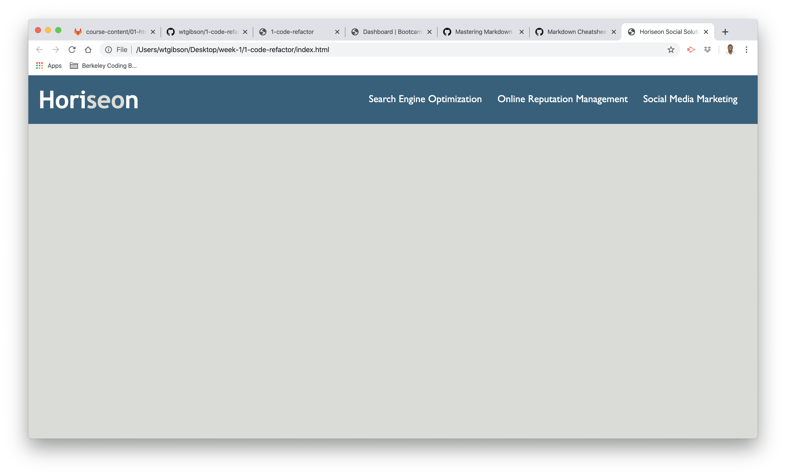

# 01 HTML CSS Git: Code Refactor

## Site Picture


## Technologies Used
- HTML - used to create elements on the DOM
- CSS - styles html elements on page
- Git - version control system to track changes to source code
- GitHub - hosts repository that can be deployed to GitHub Pages

## Summary 

```
User Story

AS A marketing agency
I WANT a codebase that follows accessibility standards
SO THAT our own site is optimized for search engines

Acceptance Criteria

GIVEN a webpage meets accessibility standards
WHEN I view the source code
THEN I find semantic HTML elements
WHEN I view the structure of the HTML elements
THEN I find that the elements follow a logical structure independent of styling and positioning
WHEN I view the image elements
THEN I find accessible alt attributes
WHEN I view the heading attributes
THEN they fall in sequential order
WHEN I view the title element
THEN I find a concise, descriptive title
```

## Code Snippet

```html
<h1>Zoo</h1>
    
    <ul>
        <li>Lion</li>
        <li>Elephant</li>
        <li>Seal</li>
        <li>Buffalo</li>
        <li>Giraffe</li>
        <li>Penguin</li>
        <li>Turtle</li>
        <li>Whale</li>
    </ul>
```

```html
<html>

</html>
```


## Author Links
[LinkedIn](https://www.linkedin.com/in/wtgibson/)
[GitHub](https://github.com/wtgibson/1-code-refactor)
